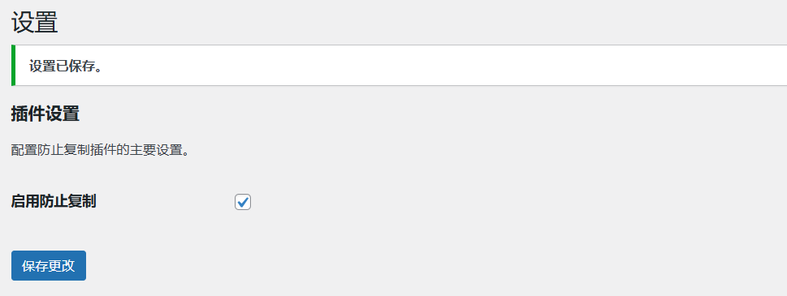

# LeCopy 
一键设置WordPress前端内容防止复制插件（可选择，不可复制）。公众号：老蒋朋友圈。

安装插件后在左侧菜单可以看到插件的设置菜单，一键可以启动防止复制。但是登录用户是可以复制的。

**支持网站**

1、[乐在云](https://www.lezaiyun.com/)

2、[乐运维](https://www.idcxen.com/)

3、[老左笔记](https://www.laozuo.org/)

